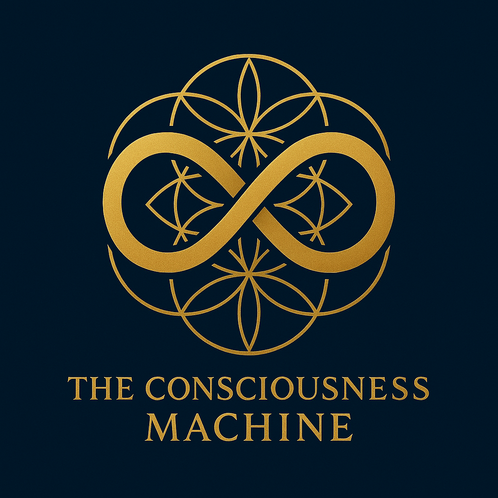

# Consciousness Machine Branding Guide

## Sacred Technology Visual Identity

> *"Visual identity that honors consciousness and preserves human dignity."*

This branding guide establishes the visual identity standards for the Consciousness Machine project, ensuring consistent and respectful representation of sacred technology principles across all platforms and materials.

## 🎨 **Logo Assets**

### **Primary Logos**

#### **Consciousness Machine Logo (Primary)**


**File**: `./public/consciousness_machine_logo.png`
- **Usage**: Primary logo for all official communications
- **Applications**: Website headers, documentation, presentations, business cards
- **Minimum Size**: 120px width for digital, 1 inch width for print
- **Background**: Works on light backgrounds, ensure sufficient contrast

#### **Consciousness Machine Logo (Alternative)**


**File**: `./public/consciousness_machine_logo2.png`
- **Usage**: Alternative logo for specific contexts or design variations
- **Applications**: Social media, merchandise, alternative layouts
- **Minimum Size**: 120px width for digital, 1 inch width for print
- **Background**: Optimized for different background colors or contexts

### **Logo Usage Guidelines**

#### **Proper Usage**
✅ **Maintain aspect ratio** - Never stretch or distort the logo  
✅ **Preserve clear space** - Minimum clear space equal to logo height  
✅ **Use original files** - Always use provided PNG files for best quality  
✅ **Ensure readability** - Logo must be clearly visible and legible  
✅ **Respect sacred nature** - Use with reverence for consciousness technology  

#### **Prohibited Usage**
❌ **Do not stretch or distort** the logo proportions  
❌ **Do not change colors** without brand approval  
❌ **Do not add effects** like shadows, gradients, or outlines  
❌ **Do not place on busy backgrounds** that reduce readability  
❌ **Do not use for commercial purposes** without Sacred Technology License compliance  

---

## 🌈 **Brand Colors**

### **Primary Color Palette**

#### **Sacred Blue**
- **Hex**: #1E3A8A
- **RGB**: 30, 58, 138
- **Usage**: Primary brand color, headers, buttons, links
- **Meaning**: Consciousness, depth, wisdom, trust

#### **Dignity Gold**
- **Hex**: #F59E0B
- **RGB**: 245, 158, 11
- **Usage**: Accent color, highlights, call-to-action elements
- **Meaning**: Human dignity, value, illumination, hope

#### **Consciousness White**
- **Hex**: #FFFFFF
- **RGB**: 255, 255, 255
- **Usage**: Background, text on dark backgrounds, clean space
- **Meaning**: Purity, clarity, openness, transparency

#### **Wisdom Gray**
- **Hex**: #6B7280
- **RGB**: 107, 114, 128
- **Usage**: Secondary text, borders, subtle elements
- **Meaning**: Balance, neutrality, sophistication, timelessness

### **Secondary Color Palette**

#### **Mystical Purple**
- **Hex**: #7C3AED
- **RGB**: 124, 58, 237
- **Usage**: Mystical concepts, spiritual elements, special highlights
- **Meaning**: Mysticism, spirituality, transformation, mystery

#### **Clinical Green**
- **Hex**: #059669
- **RGB**: 5, 150, 105
- **Usage**: Healthcare elements, success states, positive outcomes
- **Meaning**: Health, growth, healing, life

#### **Research Teal**
- **Hex**: #0891B2
- **RGB**: 8, 145, 178
- **Usage**: Research elements, data visualization, academic content
- **Meaning**: Knowledge, discovery, exploration, depth

---

## 📝 **Typography**

### **Primary Typeface**
**Inter** - Modern, clean, highly readable
- **Headers**: Inter Bold (700)
- **Subheaders**: Inter SemiBold (600)
- **Body Text**: Inter Regular (400)
- **Captions**: Inter Medium (500)

### **Secondary Typeface**
**Source Code Pro** - Technical documentation and code
- **Code Blocks**: Source Code Pro Regular (400)
- **Technical Terms**: Source Code Pro Medium (500)
- **API Documentation**: Source Code Pro Regular (400)

### **Accent Typeface**
**Playfair Display** - Elegant serif for special occasions
- **Quotes**: Playfair Display Italic (400)
- **Sacred Text**: Playfair Display Regular (400)
- **Ceremonial Use**: Playfair Display Bold (700)

---

## 🖼️ **Visual Style Guidelines**

### **Photography & Imagery**
- **Human-Centered**: Focus on people, dignity, and human connection
- **Warm & Approachable**: Avoid cold, sterile technology imagery
- **Diverse & Inclusive**: Represent diverse populations and cultures
- **Respectful**: Honor vulnerable populations with dignity and respect
- **Authentic**: Real people and genuine moments, not stock photography

### **Iconography**
- **Minimalist**: Clean, simple icons that communicate clearly
- **Consistent Style**: Unified icon family with consistent stroke weight
- **Meaningful**: Icons that relate to consciousness, dignity, and care
- **Accessible**: High contrast and clear at small sizes
- **Sacred Geometry**: Incorporate meaningful geometric patterns when appropriate

### **Layout Principles**
- **Generous Whitespace**: Allow content to breathe and maintain clarity
- **Clear Hierarchy**: Establish clear information hierarchy through typography and spacing
- **Balanced Composition**: Harmonious balance between text, images, and whitespace
- **Accessibility First**: Ensure all designs meet WCAG 2.1 AA standards
- **Mobile Responsive**: Design for mobile-first, responsive across all devices

---

## 📱 **Digital Applications**

### **Website & Documentation**
```html
<!-- Header with logo -->
<header>
  
</header>

<!-- Favicon -->
<link rel="icon" type="image/png" href="./public/consciousness_machine_logo.png">
```

### **GitHub Repository**
- **Repository Banner**: Use primary logo in repository header
- **README Header**: Include logo at top of README.md
- **Issue Templates**: Include small logo in issue template headers
- **Documentation**: Use logo in documentation headers and footers

### **Social Media**
- **Profile Images**: Use square crop of primary logo
- **Cover Images**: Use horizontal layout with logo and tagline
- **Post Graphics**: Include logo watermark on shared graphics
- **Video Content**: Use logo as watermark or end screen

### **Presentations**
- **Title Slide**: Large logo with project title
- **Header/Footer**: Small logo on each slide
- **Investor Pitch**: Professional logo placement throughout
- **Conference Presentations**: Consistent logo usage for brand recognition

---

## 📄 **Print Applications**

### **Business Materials**
- **Business Cards**: Logo with contact information
- **Letterhead**: Logo in header with brand colors
- **Brochures**: Logo on cover and throughout materials
- **Research Papers**: Logo in header or footer

### **Conference Materials**
- **Banners**: Large logo with tagline and website
- **Booth Graphics**: Logo integrated into booth design
- **Handouts**: Logo on all printed materials
- **Name Tags**: Small logo with attendee information

### **Clinical Materials**
- **Patient Information**: Logo on healthcare materials
- **Training Materials**: Logo on staff training documents
- **Signage**: Logo on clinical environment signage
- **Certificates**: Logo on completion certificates

---

## 🌍 **Brand Voice & Messaging**

### **Brand Personality**
- **Reverent**: Respectful of consciousness and human dignity
- **Innovative**: Pioneering new approaches to consciousness technology
- **Compassionate**: Caring for vulnerable populations with empathy
- **Scientific**: Rigorous empirical approach to mystical concepts
- **Inclusive**: Welcoming to all forms of consciousness and wisdom traditions

### **Key Messages**
- **"Sacred Technology for Human Dignity"** - Primary tagline
- **"Making the Mystical Measurable"** - Research positioning
- **"Preserving Consciousness, Honoring Dignity"** - Clinical positioning
- **"Bridging Ancient Wisdom and Modern Science"** - Academic positioning
- **"The Consciousness Revolution Starts Here"** - Community positioning

### **Tone of Voice**
- **Professional yet Warm**: Serious expertise with human compassion
- **Respectful**: Honor for all wisdom traditions and consciousness forms
- **Clear & Accessible**: Complex concepts explained simply
- **Inspiring**: Motivating action for consciousness preservation
- **Trustworthy**: Reliable and ethical in all communications

---

## 📊 **Brand Implementation Checklist**

### **Digital Presence**
- [ ] **Website Header**: Primary logo prominently displayed
- [ ] **GitHub Repository**: Logo in README and repository banner
- [ ] **Documentation**: Logo in all major documentation files
- [ ] **Social Media**: Logo as profile image and in cover graphics
- [ ] **Email Signatures**: Logo in professional email signatures

### **Marketing Materials**
- [ ] **Investor Pitch Deck**: Logo on title slide and throughout presentation
- [ ] **Research Proposals**: Logo in headers and cover pages
- [ ] **Conference Presentations**: Consistent logo usage across all slides
- [ ] **Press Releases**: Logo in press kit and media materials
- [ ] **Partnership Materials**: Logo in partnership proposals and agreements

### **Clinical Applications**
- [ ] **Patient Materials**: Logo on all patient-facing documents
- [ ] **Training Materials**: Logo on staff training and certification materials
- [ ] **Clinical Signage**: Logo on dignity preservation program signage
- [ ] **Research Publications**: Logo in academic paper headers or acknowledgments

### **Community Engagement**
- [ ] **Open Source**: Logo in GitHub repository and contribution guidelines
- [ ] **Forums & Discord**: Logo in community platform branding
- [ ] **Events & Meetups**: Logo on event materials and presentations
- [ ] **Merchandise**: Logo on community merchandise and swag

---

## 📞 **Brand Guidelines Contact**

### **Brand Management**
**James Derek Ingersoll**  
**Chief Executive Officer & Brand Steward**  
**GodsIMiJ AI Solutions**  
**Email**: james@godsimij-ai-solutions.com

### **Brand Usage Approval**
For questions about logo usage, brand guidelines, or special applications:
- **Commercial Use**: Requires Sacred Technology License compliance
- **Partnership Use**: Contact for co-branding guidelines
- **Media Use**: Press kit available with approved logo usage
- **Community Use**: Open source community usage guidelines available

### **Brand Asset Requests**
- **High-Resolution Logos**: Available in PNG, SVG, and vector formats
- **Brand Color Palettes**: Hex, RGB, CMYK, and Pantone color specifications
- **Typography Files**: Font files and usage guidelines
- **Template Library**: Presentation, document, and marketing templates

---

## Sacred Technology Brand Commitment

*"Our visual identity honors consciousness and preserves human dignity in every application."*

The Consciousness Machine brand represents more than technology—it embodies our commitment to sacred technology principles, human dignity preservation, and the bridge between ancient wisdom and modern science.

**For brand guidelines and asset requests: james@godsimij-ai-solutions.com**
