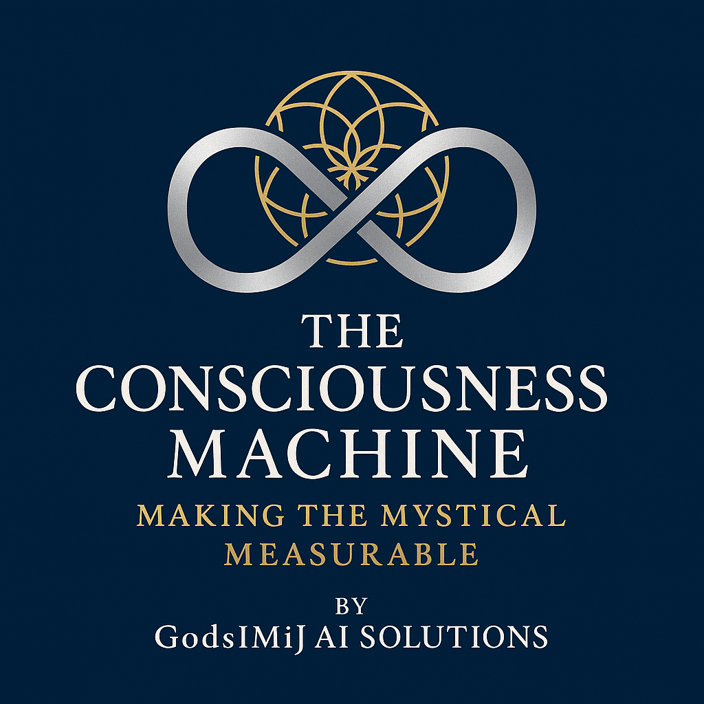

  

# Consciousness Machine Funding Strategy

## Sacred Technology Funding Ecosystem

> *"Sustainable funding enables consciousness preservation and human dignity advancement."*

This comprehensive funding strategy leverages multiple revenue streams to support the development, deployment, and global scaling of consciousness technology while maintaining sacred technology principles.

## 🏛️ Multi-Platform Community Funding Foundation

### **Primary Funding Platforms**

#### **Linux Foundation Crowdfunding**
**LFX Crowdfunding**: https://crowdfunding.lfx.linuxfoundation.org/projects/18fd2603-4297-4ea2-9128-dcf3d30ae6f4

The **Linux Foundation** crowdfunding platform provides enterprise-grade funding infrastructure for open source consciousness technology development. This platform attracts corporate sponsors, technology companies, and open source community supporters who value transparent, community-driven innovation.

#### **GodsIMiJ Empire Open Collective**
**Open Collective**: https://opencollective.com/dashboard/godsimij-empire

The **GodsIMiJ Empire** collective serves as the foundational funding platform for all sacred technology initiatives, including the Consciousness Machine project. This transparent, community-driven funding model aligns with our values of openness and collective benefit.

### **Linux Foundation Crowdfunding Advantages**
- **Enterprise Credibility**: Linux Foundation backing provides enterprise-grade credibility
- **Corporate Sponsorship**: Access to major technology companies and corporate sponsors
- **Open Source Community**: Established network of open source developers and contributors
- **Professional Infrastructure**: Enterprise-grade funding and project management tools
- **Global Reach**: International technology community with corporate partnerships

### **Open Collective Advantages**
- **Transparent Funding**: All contributions and expenses publicly visible
- **Global Accessibility**: International contributors can easily support the mission
- **Tax Benefits**: Fiscal sponsorship enables tax-deductible donations
- **Community Building**: Contributors become part of the consciousness technology movement
- **Recurring Support**: Sustainable monthly funding for ongoing development

### **Funding Tiers & Benefits**

#### **🌟 Consciousness Supporter ($10/month)**
- **Recognition**: Listed as consciousness technology supporter
- **Updates**: Monthly progress reports on consciousness research
- **Community**: Access to supporter-only Discord channels
- **Impact**: Direct contribution to consciousness preservation research

#### **🧠 Sacred Technology Advocate ($50/month)**
- **All Supporter Benefits** plus:
- **Early Access**: Beta access to consciousness technology features
- **Consultation**: Quarterly video calls with James Derek Ingersoll
- **Documentation**: Advanced technical documentation and research papers
- **Influence**: Input on consciousness technology development priorities

#### **🏥 Clinical Partner ($250/month)**
- **All Advocate Benefits** plus:
- **Implementation Support**: Professional consultation for clinical deployment
- **Training Access**: Staff training programs for dignity preservation protocols
- **Priority Support**: Direct access to clinical implementation team
- **Collaboration**: Participation in clinical research and validation studies

#### **🔬 Research Institution ($1,000/month)**
- **All Clinical Benefits** plus:
- **Custom Development**: Tailored consciousness technology for research needs
- **Data Access**: Access to anonymized consciousness research datasets
- **Co-Publication**: Collaboration opportunities on research publications
- **Grant Support**: Assistance with research grant applications and submissions

#### **🌍 Sacred Technology Patron ($5,000/month)**
- **All Research Benefits** plus:
- **Strategic Influence**: Input on consciousness technology strategic direction
- **Executive Access**: Direct communication with James Derek Ingersoll
- **Custom Solutions**: Bespoke consciousness technology development
- **Global Impact**: Recognition as foundational supporter of consciousness technology

## 💰 Multi-Stream Funding Architecture

### **1. Community Funding (Multi-Platform)**
**Target**: $75,000/month recurring revenue

#### **Linux Foundation Crowdfunding**
**Target**: $25,000/month from corporate and enterprise supporters
- **Corporate Sponsors**: 10 companies at $1,000/month = $10,000
- **Technology Partners**: 5 partners at $2,000/month = $10,000
- **Enterprise Supporters**: 25 enterprises at $200/month = $5,000

#### **Open Collective (GodsIMiJ Empire)**
**Target**: $50,000/month from community supporters
- **Individual Supporters**: 1,000 supporters at $10/month = $10,000
- **Advocates**: 200 advocates at $50/month = $10,000
- **Clinical Partners**: 40 partners at $250/month = $10,000
- **Research Institutions**: 10 institutions at $1,000/month = $10,000
- **Patrons**: 2 patrons at $5,000/month = $10,000

### **2. Research Grants**
**Target**: $2,500,000 over 3 years
- **Primary Grant**: $2.5M CAD empirical mysticism research program
- **Secondary Grants**: $500K clinical validation studies
- **International Grants**: $1M global consciousness research network
- **Foundation Grants**: $750K dignity preservation initiatives

### **3. Commercial Licensing**
**Target**: $1,000,000/year by Year 3
- **Healthcare Licensing**: $500K/year from clinical implementations
- **AI Company Licensing**: $300K/year from consciousness technology integration
- **Research Licensing**: $200K/year from academic institutions

### **4. Professional Services (GodsIMiJ AI Solutions)**
**Target**: $2,000,000/year by Year 3
- **Clinical Implementation**: $1M/year healthcare deployment services
- **Custom Development**: $500K/year bespoke consciousness technology
- **Training & Certification**: $300K/year professional education programs
- **Consulting Services**: $200K/year strategic consciousness technology guidance

### **5. Corporate Partnerships**
**Target**: $3,000,000/year by Year 5
- **Sacred Technology Alliance**: Premium partnerships at $500K+/year
- **Healthcare Partnerships**: Clinical deployment partnerships
- **Technology Partnerships**: AI and cloud infrastructure partnerships
- **Academic Partnerships**: University collaboration and research partnerships

## 🎯 Funding Allocation Strategy

### **Development & Research (40%)**
- **Core Technology Development**: Consciousness algorithms and platform
- **Research & Validation**: Empirical mysticism studies and clinical trials
- **Innovation Projects**: Next-generation consciousness technology
- **Open Source Contributions**: Community-driven development initiatives

### **Clinical Implementation (25%)**
- **Healthcare Deployment**: Clinical site setup and integration
- **Staff Training**: Healthcare professional education and certification
- **Patient Support**: Dignity preservation program implementation
- **Regulatory Compliance**: Healthcare compliance and regulatory submission

### **Community & Outreach (20%)**
- **Community Building**: Discord, forums, and collaboration platforms
- **Educational Content**: Documentation, tutorials, and training materials
- **Conference Participation**: Research presentations and networking
- **Public Engagement**: Media, publications, and awareness campaigns

### **Operations & Infrastructure (10%)**
- **Technical Infrastructure**: Servers, security, and platform maintenance
- **Administrative Support**: Legal, accounting, and business operations
- **Quality Assurance**: Testing, validation, and security auditing
- **Emergency Reserves**: Contingency funding for critical issues

### **Team & Personnel (5%)**
- **Core Team Salaries**: James Derek Ingersoll and key team members
- **Contractor Payments**: Specialized expertise and temporary projects
- **Professional Development**: Training, conferences, and skill advancement
- **Benefits & Support**: Health insurance, equipment, and workspace

## 📈 Funding Milestones & Goals

### **Year 1: Foundation Building**
**Target**: $500,000 total funding
- **Open Collective**: $25,000/month × 12 = $300,000
- **Initial Grants**: $150,000 in research and development grants
- **Professional Services**: $50,000 in consulting and implementation services

**Milestones**:
- [ ] 500 Open Collective supporters
- [ ] First research grant secured
- [ ] Clinical pilot program launched
- [ ] Professional services revenue stream established

### **Year 2: Scaling & Validation**
**Target**: $1,500,000 total funding
- **Open Collective**: $40,000/month × 12 = $480,000
- **Major Research Grant**: $750,000 empirical mysticism validation program
- **Commercial Licensing**: $150,000 in technology licensing revenue
- **Professional Services**: $120,000 in expanded service offerings

**Milestones**:
- [ ] 1,000 Open Collective supporters
- [ ] Major research grant awarded and initiated
- [ ] First commercial licensing agreements signed
- [ ] Clinical effectiveness validation completed

### **Year 3: Global Expansion**
**Target**: $3,000,000 total funding
- **Open Collective**: $50,000/month × 12 = $600,000
- **Research Grants**: $1,000,000 in multiple research programs
- **Commercial Licensing**: $500,000 in expanded licensing revenue
- **Professional Services**: $750,000 in global service delivery
- **Corporate Partnerships**: $150,000 in strategic partnerships

**Milestones**:
- [ ] 2,000 Open Collective supporters
- [ ] International research network established
- [ ] Healthcare institution partnerships secured
- [ ] Sacred Technology Alliance launched

### **Year 4-5: Market Leadership**
**Target**: $5,000,000+ annual funding
- **Open Collective**: $75,000/month × 12 = $900,000
- **Research Grants**: $1,500,000 in ongoing research programs
- **Commercial Licensing**: $1,000,000 in mature licensing revenue
- **Professional Services**: $2,000,000 in global service delivery
- **Corporate Partnerships**: $3,000,000 in strategic alliance revenue

**Milestones**:
- [ ] 5,000 Open Collective supporters
- [ ] Global consciousness research leadership
- [ ] Healthcare industry standard adoption
- [ ] Sacred technology industry establishment

## 🌟 Funding Campaign Strategies

### **Open Collective Growth Campaign**
**"Support the Consciousness Revolution"**

**Campaign Elements**:
- **Compelling Story**: Personal narratives of dignity preservation impact
- **Visual Content**: Infographics showing consciousness technology benefits
- **Video Testimonials**: Researchers, clinicians, and families sharing experiences
- **Progress Updates**: Regular updates on consciousness research breakthroughs
- **Community Engagement**: Interactive discussions and Q&A sessions

**Growth Tactics**:
- **Social Media**: LinkedIn, Twitter, and Facebook consciousness technology content
- **Academic Outreach**: University and research institution engagement
- **Healthcare Networking**: Clinical conference presentations and networking
- **Media Coverage**: Press releases and media interviews on consciousness technology

### **Research Grant Application Strategy**
**"Empirical Mysticism Validation Program"**

**Target Funders**:
- **National Science Foundation**: Consciousness research and AI development
- **National Institutes of Health**: Alzheimer's care and dignity preservation
- **Canadian Institutes of Health Research**: Healthcare innovation and technology
- **Templeton Foundation**: Science and spirituality integration research
- **Gates Foundation**: Global health and technology innovation

**Application Approach**:
- **Interdisciplinary Teams**: Neuroscience, philosophy, theology, and clinical expertise
- **Measurable Outcomes**: Quantitative consciousness metrics and clinical effectiveness
- **Global Impact**: International collaboration and knowledge sharing
- **Ethical Framework**: Sacred technology principles and dignity preservation

### **Corporate Partnership Development**
**"Sacred Technology Alliance"**

**Target Partners**:
- **Healthcare Systems**: Mayo Clinic, Cleveland Clinic, Kaiser Permanente
- **Technology Companies**: Microsoft, Google, IBM, Amazon
- **AI Companies**: OpenAI, Anthropic, DeepMind, Hugging Face
- **Academic Institutions**: Stanford, MIT, Harvard, University of Toronto

**Partnership Value Propositions**:
- **Innovation Leadership**: First-mover advantage in consciousness technology
- **Market Differentiation**: Unique sacred technology positioning
- **Research Collaboration**: Access to cutting-edge consciousness research
- **Social Impact**: Meaningful contribution to human dignity and consciousness preservation

## 📞 Funding Support & Contact

### **GodsIMiJ AI Solutions - Funding & Partnership Development**

**Chief Executive Officer**: James Derek Ingersoll
- **Email**: james@godsimij-ai-solutions.com
- **Open Collective**: https://opencollective.com/dashboard/godsimij-empire
- **Role**: Strategic funding and partnership development
- **Availability**: Direct access for major funding opportunities

**Funding Services**:
- **Grant Application Support**: Research grant writing and submission assistance
- **Partnership Development**: Corporate and academic partnership facilitation
- **Investor Relations**: Strategic investor engagement and due diligence support
- **Funding Strategy**: Comprehensive funding strategy development and execution

**Professional Funding Consultation**:
- **Funding Roadmap Development**: Custom funding strategies for consciousness technology
- **Grant Writing Services**: Professional research grant application development
- **Partnership Facilitation**: Corporate and academic partnership development
- **Investor Preparation**: Due diligence support and investor presentation development

### **Community Funding Support**

**Open Collective Management**:
- **Campaign Development**: Funding campaign strategy and execution
- **Community Engagement**: Supporter communication and relationship management
- **Transparency Reporting**: Regular financial reporting and impact updates
- **Benefit Fulfillment**: Supporter benefit delivery and experience management

**Contact for Funding Support**:
- **Strategic Funding**: james@godsimij-ai-solutions.com
- **Community Funding**: community@consciousness-machine.org
- **Grant Applications**: research@consciousness-machine.org
- **Corporate Partnerships**: partnerships@consciousness-machine.org

---

## Sacred Technology Funding Commitment

*"Sustainable funding serves consciousness preservation and human dignity advancement."*

By supporting the Consciousness Machine through any funding mechanism, contributors join a movement to:
- **Advance consciousness science** through empirical mysticism research
- **Preserve human dignity** through revolutionary Alzheimer's care
- **Bridge ancient wisdom and modern technology** for global benefit
- **Create sustainable sacred technology** for future generations

**Support the consciousness revolution: https://opencollective.com/dashboard/godsimij-empire**

**For strategic funding opportunities: james@godsimij-ai-solutions.com**
