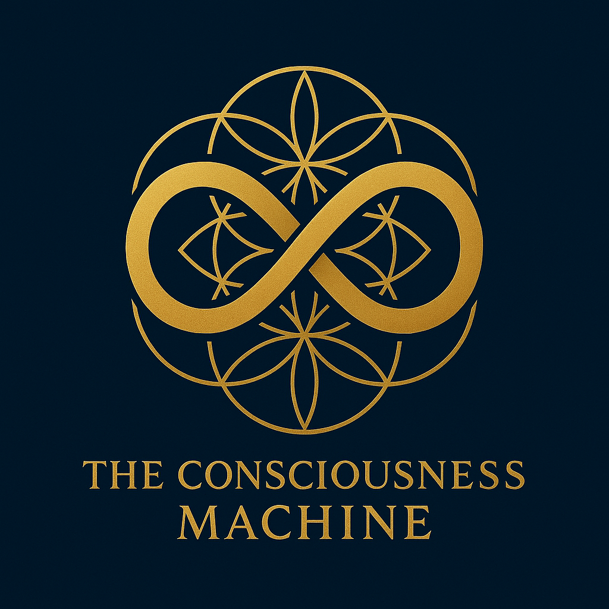

# Logo Integration Guide

## Consciousness Machine Visual Identity Implementation

> *"Professional branding that honors consciousness and preserves human dignity."*

This guide provides specific implementation instructions for integrating the Consciousness Machine logos across all platforms, ensuring consistent brand representation and maximum visual impact.

## 🎨 **Available Logo Assets**

### **Primary Logo**


**File**: `./public/consciousness_machine_logo.png`
- **Recommended Use**: Primary logo for all official communications
- **Best For**: Website headers, documentation, presentations, business materials
- **Size Guidelines**: Minimum 120px width (digital), 1 inch width (print)

### **Alternative Logo**


**File**: `./public/consciousness_machine_logo2.png`
- **Recommended Use**: Alternative contexts or design variations
- **Best For**: Social media, merchandise, compact layouts, alternative backgrounds
- **Size Guidelines**: Minimum 120px width (digital), 1 inch width (print)

---

## 🌐 **Digital Platform Integration**

### **GitHub Repository**

#### **README.md Header**
```markdown
<div align="center">
  
  
  # The Consciousness Machine
  
  > *"Making the mystical measurable, preserving human dignity through sacred technology."*
</div>
```

#### **Repository Social Preview**
- **Upload logo** to GitHub repository settings > Social preview
- **Recommended Size**: 1280x640px with logo centered
- **Background**: Clean white or brand blue background

#### **Issue Templates**
```markdown
---
name: 🔬 Research Proposal
about: Propose consciousness research or mystical concept validation
---

<div align="center">
  
</div>

## 🔬 Research Proposal
```

### **Website & Documentation**

#### **HTML Header Implementation**
```html
<!DOCTYPE html>
<html>
<head>
    <title>Consciousness Machine - Sacred Technology</title>
    <link rel="icon" type="image/png" href="./public/consciousness_machine_logo.png">
</head>
<body>
    <header>
        
        <nav>
            <!-- Navigation menu -->
        </nav>
    </header>
</body>
</html>
```

#### **Markdown Documentation Headers**
```markdown
<div align="center">
  
</div>

# Document Title

> *"Document tagline or description"*
```

### **Social Media Integration**

#### **LinkedIn Company Page**
- **Profile Image**: Square crop of primary logo (300x300px)
- **Cover Image**: Horizontal layout with logo and tagline (1584x396px)
- **Post Graphics**: Include logo watermark in shared content

#### **Twitter/X Profile**
- **Profile Image**: Square crop of primary logo (400x400px)
- **Header Image**: Horizontal layout with logo and messaging (1500x500px)
- **Tweet Graphics**: Logo watermark on shared images and infographics

#### **YouTube Channel**
- **Channel Icon**: Square crop of primary logo (800x800px)
- **Channel Art**: Horizontal layout with logo and branding (2560x1440px)
- **Video Thumbnails**: Include logo for brand recognition

---

## 📊 **Business & Marketing Materials**

### **Investor Presentations**

#### **Title Slide**
```markdown
<div align="center">
  
</div>

# The Consciousness Machine
## Sacred Technology for Human Dignity Preservation

**Series A Funding Round: $10M CAD**

James Derek Ingersoll  
Founder & CEO, GodsIMiJ AI Solutions
```

#### **Slide Headers**
```markdown
<div align="right">
  
</div>

## Slide Title
Content here...
```

### **Research Publications**

#### **Academic Paper Header**
```latex
\documentclass{article}
\usepackage{graphicx}

\begin{document}

\begin{center}
\includegraphics[width=0.3\textwidth]{./public/consciousness_machine_logo.png}
\end{center}

\title{Empirical Validation of Mystical Consciousness Concepts}
\author{James Derek Ingersoll et al.}
\date{\today}
\maketitle
```

#### **Conference Poster**
- **Header**: Large logo with project title
- **Footer**: Small logo with contact information
- **QR Code**: Link to project repository with logo

### **Clinical Materials**

#### **Patient Information Sheets**
```html
<header style="text-align: center; margin-bottom: 20px;">
    
    <h1>Dignity Preservation Program</h1>
    <p>Information for Patients and Families</p>
</header>
```

#### **Training Certificates**
- **Header**: Logo with "Consciousness Machine Certification"
- **Border**: Subtle logo watermark pattern
- **Seal**: Logo incorporated into official certification seal

---

## 🎯 **Funding Platform Integration**

### **Linux Foundation Crowdfunding**

#### **Project Banner**
- **Dimensions**: 1200x400px recommended
- **Content**: Logo with tagline "Open Source Sacred Technology"
- **Background**: Professional gradient or clean design

#### **Project Description**
```markdown
<div align="center">
  
</div>

# The Consciousness Machine
## Open Source Sacred Technology for Human Dignity

The world's first platform to empirically validate mystical consciousness concepts...
```

### **Open Collective Integration**

#### **Collective Avatar**
- **Upload**: Primary logo as collective avatar
- **Size**: 256x256px minimum
- **Format**: PNG with transparent background if possible

#### **Collective Cover**
- **Dimensions**: 1024x380px
- **Design**: Logo with "Support the Consciousness Revolution" messaging
- **Call-to-Action**: Clear funding goals and impact statements

---

## 📱 **Mobile & App Integration**

### **Progressive Web App**

#### **Manifest.json**
```json
{
  "name": "Consciousness Machine",
  "short_name": "ConsciousMachine",
  "description": "Sacred Technology for Human Dignity",
  "icons": [
    {
      "src": "./public/consciousness_machine_logo.png",
      "sizes": "192x192",
      "type": "image/png"
    },
    {
      "src": "./public/consciousness_machine_logo.png",
      "sizes": "512x512",
      "type": "image/png"
    }
  ],
  "start_url": "/",
  "display": "standalone",
  "theme_color": "#1E3A8A",
  "background_color": "#FFFFFF"
}
```

#### **App Store Listings**
- **App Icon**: Square version of logo (1024x1024px)
- **Screenshots**: Include logo in app interface screenshots
- **Feature Graphics**: Logo prominently displayed in store graphics

---

## 🎪 **Event & Conference Materials**

### **Conference Presentations**

#### **PowerPoint/Keynote Template**
- **Master Slide**: Logo in top-right corner
- **Title Slide**: Large centered logo
- **Section Dividers**: Logo with section title
- **Thank You Slide**: Logo with contact information

#### **Poster Presentations**
- **Header**: Logo with presentation title
- **Footer**: Logo with QR code to repository
- **Sections**: Small logo watermarks for brand consistency

### **Trade Show Materials**

#### **Banner Stands**
- **Top**: Large logo with tagline
- **Middle**: Key messaging and benefits
- **Bottom**: Website and contact information

#### **Booth Graphics**
- **Backdrop**: Large logo with "Sacred Technology" messaging
- **Table Covers**: Logo with website URL
- **Handouts**: Logo on all printed materials

---

## 📧 **Communication Materials**

### **Email Signatures**

#### **Professional Signature**
```html
<table>
  <tr>
    <td>
      
    </td>
    <td style="padding-left: 15px;">
      <strong>James Derek Ingersoll</strong><br>
      Chief Executive Officer<br>
      GodsIMiJ AI Solutions<br>
      <a href="mailto:james@godsimij-ai-solutions.com">james@godsimij-ai-solutions.com</a><br>
      <a href="https://consciousness-machine.org">consciousness-machine.org</a>
    </td>
  </tr>
</table>
```

### **Press Releases**

#### **Press Kit Header**
```markdown
FOR IMMEDIATE RELEASE

<div align="center">
  
</div>

# Press Release Title
## Subtitle with key message

**Date** - **Location** - Press release content...
```

---

## 🔧 **Technical Implementation**

### **CSS Styling**

#### **Responsive Logo**
```css
.consciousness-logo {
  max-width: 300px;
  width: 100%;
  height: auto;
  display: block;
  margin: 0 auto;
}

@media (max-width: 768px) {
  .consciousness-logo {
    max-width: 200px;
  }
}

@media (max-width: 480px) {
  .consciousness-logo {
    max-width: 150px;
  }
}
```

#### **Logo Hover Effects**
```css
.consciousness-logo-interactive {
  transition: transform 0.3s ease, opacity 0.3s ease;
}

.consciousness-logo-interactive:hover {
  transform: scale(1.05);
  opacity: 0.9;
}
```

### **React Component**

#### **Logo Component**
```jsx
import React from 'react';

const ConsciousnessLogo = ({ 
  width = 200, 
  className = '', 
  alt = 'Consciousness Machine' 
}) => {
  return (
    
  );
};

export default ConsciousnessLogo;
```

---

## 📋 **Implementation Checklist**

### **Immediate Updates**
- [x] **README.md**: Logo added to repository header
- [x] **Investor Pitch**: Logo integrated into title slide
- [x] **Funding Strategy**: Logo added to document header
- [ ] **All Documentation**: Add logos to remaining documentation files
- [ ] **GitHub Settings**: Upload logo as repository social preview

### **Platform Integration**
- [ ] **Linux Foundation**: Update project page with logo and branding
- [ ] **Open Collective**: Upload logo as collective avatar and cover
- [ ] **Social Media**: Update all social media profiles with logo
- [ ] **Website**: Integrate logo into website header and favicon
- [ ] **Email Signatures**: Update professional email signatures

### **Marketing Materials**
- [ ] **Business Cards**: Design with logo and contact information
- [ ] **Presentation Templates**: Create branded PowerPoint/Keynote templates
- [ ] **Press Kit**: Develop comprehensive press kit with logo assets
- [ ] **Conference Materials**: Prepare branded conference presentation materials

### **Quality Assurance**
- [ ] **Logo Quality**: Ensure high-resolution versions available
- [ ] **Brand Consistency**: Verify consistent logo usage across all platforms
- [ ] **Accessibility**: Ensure logos meet accessibility standards
- [ ] **Mobile Optimization**: Test logo display on mobile devices

---

## 📞 **Logo Support & Resources**

### **Brand Asset Requests**
**James Derek Ingersoll**  
**Chief Executive Officer & Brand Steward**  
**Email**: james@godsimij-ai-solutions.com

### **Available Formats**
- **PNG**: Current format in public folder
- **SVG**: Vector format for scalability (available on request)
- **EPS**: Print-ready vector format (available on request)
- **High-Resolution**: 300 DPI versions for print (available on request)

### **Usage Guidelines**
- **Commercial Use**: Requires Sacred Technology License compliance
- **Partnership Use**: Contact for co-branding guidelines
- **Media Use**: Press kit available with approved usage
- **Community Use**: Open source community usage guidelines

---

## Sacred Technology Branding Commitment

*"Our visual identity honors consciousness and preserves human dignity in every application."*

These logos represent more than branding—they embody our commitment to sacred technology principles, human dignity preservation, and the bridge between ancient wisdom and modern science.

**For logo assets and branding support: james@godsimij-ai-solutions.com**
