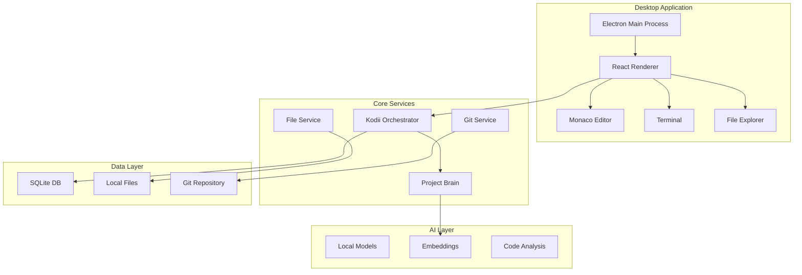

# SKIDE Architecture

## Overview

SKIDE (Sovereign Kodii IDE) is a privacy-first, offline-first desktop IDE with integrated AI intelligence. Built on Electron + Vite + React, it provides a VS Code-like experience with a powerful AI assistant called Kodii.

## Core Principles

1. **Sovereignty**: No external dependencies or cloud calls required
2. **Privacy**: All data stays local, no telemetry
3. **Offline-First**: Full functionality without internet
4. **Auditability**: Reproducible builds and clear logs
5. **Kodii-Only**: Single integrated AI, no external assistants

## Architecture Overview



## Component Architecture

### Main Process (Electron)
- **index.ts**: Application lifecycle and window management
- **preload.ts**: Secure API exposure to renderer
- **IPC Handlers**: File system, Git, Terminal operations

### Renderer Process (React)
- **App.tsx**: Main application component
- **Layout**: Resizable panel system
- **Editor**: Monaco editor with tabs
- **FileExplorer**: Project file tree
- **Terminal**: Integrated terminal with xterm.js
- **Git**: Version control panel
- **KodiiPalette**: Command palette interface

### Core Package (`@skide/core`)
- **DatabaseConnection**: SQLite operations
- **KodiiOrchestrator**: AI workflow orchestration
- **Types**: Shared TypeScript definitions

## Data Flow

### 1. Project Loading
```
User Opens Project → File Service → Project Brain → Database Index
```

### 2. Kodii Command Execution
```
Command Palette → Kodii Orchestrator → Session Creation → AI Processing → Artifact Generation
```

### 3. File Editing
```
Monaco Editor → File Service → Local Storage → Git Detection → Project Brain Update
```

## Kodii AI System

### Session Management
- Each AI interaction creates a session
- Sessions track context, messages, and artifacts
- Support for long-running workflows (PRD → Tasks → Implementation)

### Command Types
1. **Workflow Commands**: PRD, Task Graph, Scaffold, Implement
2. **Code Commands**: Explain, Optimize, Test Generation
3. **Git Commands**: Review, Commit Messages, Release Notes
4. **Project Commands**: Analysis, Search, Documentation

### Artifact System
- Structured outputs from Kodii (PRDs, code, tests, docs)
- Version tracking and approval workflow
- Direct file generation capability

## Database Schema

### Core Tables
- **projects**: Project metadata and indexing info
- **files**: File content and embeddings
- **kodii_sessions**: AI interaction sessions
- **kodii_messages**: Conversation history
- **artifacts**: Generated code, docs, and plans
- **git_history**: Commit tracking and analysis

### Search & Intelligence
- **files_fts**: Full-text search index
- **embeddings**: Semantic vector storage for code search
- **Vector similarity**: Local embedding-based search

## Security Model

### Process Isolation
- Main process has file system access
- Renderer process runs in sandboxed environment
- IPC communication through secure preload script

### Data Protection
- No network requests without explicit user consent
- Local encryption for sensitive data
- Audit logs for all AI interactions

### Context Isolation
- Electron context isolation enabled
- Node integration disabled in renderer
- CSP headers for additional protection

## Performance Considerations

### Database Optimization
- WAL mode for concurrent access
- Indexes on frequently queried columns
- Prepared statements for bulk operations
- Regular VACUUM and ANALYZE

### Memory Management
- Monaco editor virtualization
- File content lazy loading
- Embedding chunking for large files
- Terminal output buffering

### AI Processing
- Local model inference
- Streaming responses for long operations
- Context window management
- Result caching

## Extension Points

### Plugin System (Future)
```typescript
interface SKIDEPlugin {
  id: string
  name: string
  activate(context: PluginContext): void
  deactivate(): void
}
```

### Custom Commands
```typescript
interface CustomCommand {
  id: string
  title: string
  handler: (context: CommandContext) => Promise<void>
}
```

### Language Support
- Monaco language definitions
- Custom syntax highlighting
- Intelligence providers
- Formatter integration

## Development Workflow

### Left Hand (Internal)
- Full Kodii capabilities
- Advanced AI features
- Internal tooling and metrics
- Proprietary algorithms

### Right Hand (Public)
- Demo-safe features
- Open source components
- Public documentation
- Community features

## Deployment

### Development
```bash
pnpm dev              # Start development server
pnpm lint             # Code quality checks
pnpm test             # Run test suite
```

### Production
```bash
pnpm build            # Build for production
pnpm compile          # Package as executable
pnpm dist             # Create installer
```

### Distribution
- Electron Builder for cross-platform packages
- Auto-updater for seamless updates
- Code signing for security
- Portable builds for no-install usage

## Monitoring & Observability

### Logging
- Structured logging with levels
- Separate logs for main/renderer processes
- AI interaction audit trail
- Performance metrics

### Diagnostics
- Health check endpoints
- Database integrity checks
- Memory usage monitoring
- AI model performance tracking

## Future Architecture

### Planned Enhancements
1. **Distributed Processing**: Multiple Kodii agents
2. **Advanced Models**: Larger local models
3. **Collaboration**: Multi-user project support
4. **Cloud Sync**: Optional encrypted backup
5. **Advanced Analytics**: Code quality metrics

### Scalability
- Plugin architecture for extensibility
- Microservice decomposition potential
- Cloud-optional hybrid architecture
- Enterprise deployment models