# Kodii - Sovereign Development Environment

<div align="center">


[](./LICENSE)
[](.)
[](.)

*Where code becomes craft, and development becomes mastery*

</div>

## 🎯 Philosophy

Kodii is more than an IDE—it's a **development philosophy** built on the principles of **digital sovereignty**, **flow state programming**, and **craftsmanship over mere coding**. 

In a world of cloud dependencies and surveillance capitalism, Kodii stands as a beacon of **developer autonomy**: your code, your rules, your kingdom. We believe that the best software emerges when developers can enter that sacred space where time ceases to exist and pure creation flows.

## ⚡ Core Principles

### 🔥 **Sovereignty First**
Your development environment should serve **you**, not distant corporate masters. Kodii operates entirely offline, ensuring your intellectual property and creative process remain under your complete control.

### 🧘 **Flow State Engineering** 
Great code emerges from deep focus and uninterrupted thought. Kodii's interface is designed to minimize cognitive friction and maximize the chances of entering that coveted flow state where breakthrough solutions emerge.

### ⚔️ **Craftsmanship Over Convenience**
We believe programming is both art and martial discipline. Every feature in Kodii is designed to make you a better developer, not just a faster one.

## ✨ Capabilities

### 🎨 **Intelligent Code Assistance**
- **Contextual Refactoring** - Transform chaos into elegant architecture
- **Project-Wide Analysis** - See patterns and opportunities across your entire codebase  
- **Flow-Preserving Suggestions** - AI that enhances without interrupting your creative process
- **Local Intelligence** - All AI processing happens on your machine—no cloud, no compromise

### 🏗️ **Sovereign Architecture**
- **Monaco Editor Core** - The same engine that powers VS Code, but truly yours
- **Offline-First Design** - Full functionality without internet dependency
- **Local AI Models** - Intelligence without surveillance
- **Encrypted Project Storage** - Your ideas protected by modern cryptography

### 🔧 **Developer Experience**
- **Zero-Telemetry Promise** - What happens in your IDE, stays in your IDE
- **Git Integration** - Seamless version control without leaving your flow
- **Multi-Language Mastery** - TypeScript, Python, Rust, Go, and beyond
- **Plugin Ecosystem** - Extend Kodii while maintaining sovereignty

## 🚀 Getting Started

### The Initiation
```bash
# Clone the source of truth
git clone https://github.com/godsimij/kodii.git
cd kodii

# Gather the tools
pnpm install

# Begin your journey
pnpm dev
```

### First Session
```bash
# Initialize your realm
kodii init my-project

# Enter the workspace
cd my-project

# Start crafting
kodii
```

## 🎮 Command Mastery

| Command | Purpose | Flow Impact |
|---------|---------|-------------|
| `refactor <file>` | **Transform** code into its higher form | Maintains flow while improving structure |
| `analyze` | **Divine** the true nature of your project | Reveals hidden patterns and opportunities |
| `test <file>` | **Forge** comprehensive test coverage | Builds confidence without breaking focus |
| `docs <file>` | **Inscribe** knowledge for future warriors | Documents wisdom while memories are fresh |
| `/flow` | **Enter** enhanced focus mode | Minimizes distractions, maximizes depth |
| `/zen` | **Achieve** distraction-free coding | Pure editor, pure thought |

## 🏛️ Architecture

Kodii follows the **Fortress Pattern**—a self-contained, defensible architecture that serves the developer first:

```mermaid
graph TB
    A[🧠 Kodii Core<br/>The Mind] --> B[✍️ Monaco Editor<br/>The Hand]
    A --> C[🤖 AI Engine<br/>The Oracle]
    A --> D[💾 File System<br/>The Memory]
    A --> E[⚡ Terminal<br/>The Voice]
    
    C --> F[🏠 Local Models<br/>Sovereign Intelligence]
    C --> G[🔍 Analysis Engine<br/>Pattern Recognition]
    C --> H[🌊 Flow Engine<br/>Context Preservation]
    
    style A fill:#ff6b35,stroke:#333,stroke-width:3px,color:#fff
    style F fill:#4ecdc4,stroke:#333,stroke-width:2px
    style G fill:#4ecdc4,stroke:#333,stroke-width:2px
    style H fill:#4ecdc4,stroke:#333,stroke-width:2px
```



### Technology Foundation
- **Frontend Fortress**: Electron + React + TypeScript
- **Editor Engine**: Monaco (battle-tested, sovereign)
- **AI Oracle**: Local transformer models + vector embeddings
- **Data Sanctum**: SQLite + pgvector for complex projects
- **Build Arsenal**: Vite + esbuild for lightning-fast iteration

## 🧘 The Flow State Promise

### What is Flow State Programming?

Flow state is that magical zone where:
- ⏰ Time perception shifts—hours feel like minutes
- 🎯 Complete focus on the task at hand
- 💡 Solutions emerge from deeper intuition
- 🔄 Feedback loops become instantaneous
- ⚡ Your best work happens naturally

### How Kodii Enables Flow

1. **Minimal Cognitive Load** - Interface fades away, code remains
2. **Instant Feedback** - No waiting for builds, tests, or analysis
3. **Context Preservation** - AI remembers where you were when interrupted
4. **Distraction Elimination** - No notifications, no cloud sync delays
5. **Sacred Space** - Your workspace is truly yours

## 🔒 Sovereignty Guarantees

### The Kodii Covenant
```
🛡️ YOUR CODE NEVER LEAVES YOUR MACHINE
🛡️ ZERO TELEMETRY, ZERO SURVEILLANCE  
🛡️ COMPLETE AUDIT TRAIL OF ALL AI INTERACTIONS
🛡️ ENCRYPTED LOCAL STORAGE BY DEFAULT
🛡️ OPEN SOURCE FOUNDATION, TRANSPARENT OPERATIONS
```

### Why Sovereignty Matters
In an age where your IDE can become a surveillance tool and your code can train someone else's AI without consent, **digital sovereignty** isn't paranoia—it's professional responsibility.

## 🗺️ The Journey Ahead

### Phase I: Foundation *(Current)*
- [x] Core IDE with flow-optimized interface
- [x] Local AI integration (no cloud dependencies)
- [x] Project analysis and intelligent suggestions
- [ ] Plugin architecture for community extensions
- [ ] Multi-language intelligence expansion

### Phase II: Mastery
- [ ] Advanced code generation with context awareness
- [ ] Project templates and workflow automation  
- [ ] Performance profiling and optimization guidance
- [ ] Collaborative sovereignty (team features without compromise)

### Phase III: Transcendence
- [ ] Cross-project knowledge synthesis
- [ ] AI-assisted architectural guidance
- [ ] Community knowledge sharing (opt-in, sovereign)
- [ ] Advanced flow state optimization

## 🤝 Community of Practice

### Join the Movement
- **🗣️ Discussions**: [GitHub Community](https://github.com/godsimij/kodii/discussions)
- **⚡ Issues**: [Bug Reports & Ideas](https://github.com/godsimij/kodii/issues)
- **💬 Discord**: [Developer Collective](https://discord.gg/kodii-flow)
- **📱 Updates**: [@KodiiDev](https://twitter.com/kodiidev)

### Contributing to the Craft

We welcome contributions from fellow practitioners who share our vision of sovereign development:

1. **Fork** the repository
2. **Create** a feature branch: `git checkout -b feature/flow-enhancement`
3. **Commit** with intention: `git commit -m 'feat: enhance flow state detection'`
4. **Share** your contribution: `git push origin feature/flow-enhancement`
5. **Open** a Pull Request

## 📊 Performance Metrics

| Metric | Target | Philosophy |
|--------|--------|------------|
| **Cold Start** | <3 seconds | Respect for developer time |
| **Memory Usage** | <500MB | Efficiency enables focus |
| **AI Response** | <2 seconds | Fast enough to maintain flow |
| **File Analysis** | <100ms | Instant feedback, zero friction |

## 📄 The Flame Protocol License

Kodii operates under the **Flame Protocol License**—a new paradigm in software licensing designed for the sovereignty age:

**Core Tenets:**
- ✅ **Commercial Freedom** - Build your empire with Kodii
- ✅ **Source Transparency** - No black boxes, no hidden agendas
- ✅ **Data Sovereignty** - Your data belongs to you, period
- ✅ **Fork Rights** - True ownership means true control
- ❌ **Surveillance Prohibition** - Cannot be used for user tracking
- ❌ **Lock-in Prevention** - Must preserve user migration rights

*Read the full [LICENSE](./LICENSE) for complete terms*

## 🎭 For the Initiated

> *"In the beginning was the Word, and the Word was Code, and the Code was with the Developer."*

Those who have walked the path of digital creation know that programming is more than mere instruction—it is **digital alchemy**, the transformation of thought into reality through the medium of logic and language.

Kodii honors this sacred practice by providing not just tools, but a **sanctum** where the ancient arts of algorithm and architecture can be practiced with proper reverence.

**May your code compile cleanly, may your tests pass green, and may your deployments bring prosperity to your digital realm.**

---

<div align="center">

## 🔥 **KODII** 🔥
***Where Craft Meets Code***

*"The blade that cuts cleanest is forged in the hottest flame"*

[🌐 Website](https://kodii.dev) • [📚 Documentation](./docs/) • [💬 Community](https://discord.gg/kodii-flow)

</div>