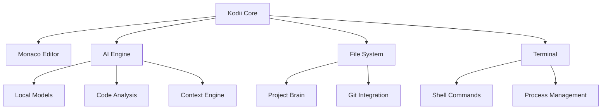

# Kodii - Sovereign IDE & AI Companion

<div align="center">


[](./LICENSE)
[](.)
[](.)

*A privacy-first, offline-capable development environment with integrated AI assistance*

</div>

## 🎯 Overview

Kodii is a **sovereign coding environment** that combines the power of a modern IDE with intelligent AI assistance. Built on principles of privacy, transparency, and developer autonomy, Kodii ensures your code and data remain under your complete control.

Unlike cloud-dependent solutions, Kodii operates entirely offline while providing sophisticated code analysis, refactoring, and project intelligence through local AI models.

## ✨ Key Features

### 🔧 Core IDE Functionality
- **Monaco Editor Integration** - Full VS Code editor experience
- **Multi-Language Support** - TypeScript, Python, Rust, Go, and more
- **Project Tree Management** - Intuitive file navigation and organization
- **Integrated Terminal** - Full bash/shell integration
- **Git Integration** - Version control without leaving the environment

### 🤖 AI-Powered Assistance
- **Code Refactoring** - Intelligent restructuring and optimization
- **Architecture Analysis** - Project-wide insights and recommendations
- **Context-Aware Suggestions** - Understands your codebase structure
- **Documentation Generation** - Automated docs from code analysis
- **Test Generation** - Smart test creation based on implementation

### 🔒 Privacy & Sovereignty
- **Offline-First Architecture** - No mandatory cloud dependencies
- **Local AI Models** - Your code never leaves your machine
- **Transparent Operations** - Full audit trail of all AI interactions
- **Data Sovereignty** - Complete control over your development environment

## 🚀 Quick Start

### Prerequisites
- Node.js 18+ and pnpm
- Git
- 8GB+ RAM (for local AI models)

### Installation

```bash
# Clone the repository
git clone https://github.com/godsimij/kodii.git
cd kodii

# Install dependencies
pnpm install

# Start development environment
pnpm dev

# Or build for production
pnpm build
pnpm start
```

### First Run

1. **Launch Kodii** in your project directory
2. **Grant file permissions** when prompted (read/write access)
3. **Initialize AI models** (first-time setup, ~2GB download)
4. **Open your project** and start coding with AI assistance

```bash
# Example workflow
kodii init my-project
cd my-project
kodii
```

## 🛠 Commands & Usage

| Command | Description | Example |
|---------|-------------|---------|
| `refactor <file>` | Intelligent code refactoring | `refactor src/utils.ts` |
| `analyze` | Project architecture analysis | `analyze` |
| `test <file>` | Generate tests for file | `test src/auth.ts` |
| `docs <file>` | Generate documentation | `docs src/api/` |
| `/help` | Show all available commands | `/help` |
| `/status` | Current project status | `/status` |

## 🏗 Architecture



### Tech Stack
- **Frontend**: Electron + React + TypeScript
- **Editor**: Monaco (VS Code engine)
- **AI Engine**: Local transformer models
- **Database**: SQLite + pgvector (when available)
- **Build System**: Vite + esbuild

## 🔬 Development

### Project Structure
```
kodii/
├── apps/
│   └── skide/           # Main Electron app
├── packages/
│   ├── core/            # Core Kodii engine
│   ├── ai/              # AI/ML components
│   └── ui/              # Shared UI components
├── plugins/             # Optional extensions
└── docs/                # Documentation
```

### Contributing

1. Fork the repository
2. Create a feature branch: `git checkout -b feature/amazing-feature`
3. Commit changes: `git commit -m 'feat: add amazing feature'`
4. Push to branch: `git push origin feature/amazing-feature`
5. Open a Pull Request

### Development Commands

```bash
# Start development environment
pnpm dev

# Run tests
pnpm test

# Lint and format
pnpm lint
pnpm format

# Build for production
pnpm build

# Run E2E tests
pnpm test:e2e
```

## 📊 Performance & Benchmarks

| Metric | Value | Notes |
|--------|-------|-------|
| Startup Time | <3s | Cold start with AI models |
| Memory Usage | ~500MB | Base + Monaco + AI |
| File Analysis | <100ms | Per file, cached results |
| Code Generation | <2s | Average response time |

## 🔐 Security & Privacy

- **No Telemetry** - Zero data collection or reporting
- **Local Processing** - All AI inference runs locally
- **Encrypted Storage** - Sensitive data encrypted at rest
- **Network Isolation** - Can operate completely offline
- **Audit Logs** - Complete history of AI interactions

## 📚 Documentation

- [Installation Guide](./docs/installation.md)
- [User Manual](./docs/user-guide.md)
- [API Reference](./docs/api.md)
- [Plugin Development](./docs/plugins.md)
- [Architecture Deep Dive](./docs/architecture.md)

## 🗺 Roadmap

### v1.0 - Foundation *(Current)*
- [x] Core IDE functionality
- [x] Local AI integration
- [x] Basic project analysis
- [ ] Plugin system
- [ ] Multi-language support

### v1.1 - Intelligence
- [ ] Advanced code generation
- [ ] Project templates
- [ ] Smart refactoring suggestions
- [ ] Performance profiling

### v1.2 - Collaboration
- [ ] Team project sharing
- [ ] Code review workflows
- [ ] Distributed version control
- [ ] Peer-to-peer sync

## 🤝 Community

- **Discussions**: [GitHub Discussions](https://github.com/godsimij/kodii/discussions)
- **Issues**: [Bug Reports & Feature Requests](https://github.com/godsimij/kodii/issues)
- **Discord**: [Developer Community](https://discord.gg/kodii-dev)
- **Twitter**: [@KodiiIDE](https://twitter.com/kodiiide)

## 📄 License

Kodii is released under the **Flame Protocol License** - a privacy-first, developer-friendly license ensuring:

- ✅ Commercial use permitted
- ✅ Source code transparency required
- ✅ User data sovereignty protected
- ✅ No vendor lock-in
- ❌ No data harvesting allowed
- ❌ No proprietary extensions

See [LICENSE](./LICENSE) for full details.

## 🙏 Acknowledgments

Built with modern web technologies and inspired by the principles of developer sovereignty, digital privacy, and collaborative innovation.

---

<div align="center">

**Kodii** - *Code with Confidence, Create with Sovereignty*

[Website](https://kodii.dev) • [Documentation](./docs/) • [Community](https://discord.gg/kodii-dev)

</div>