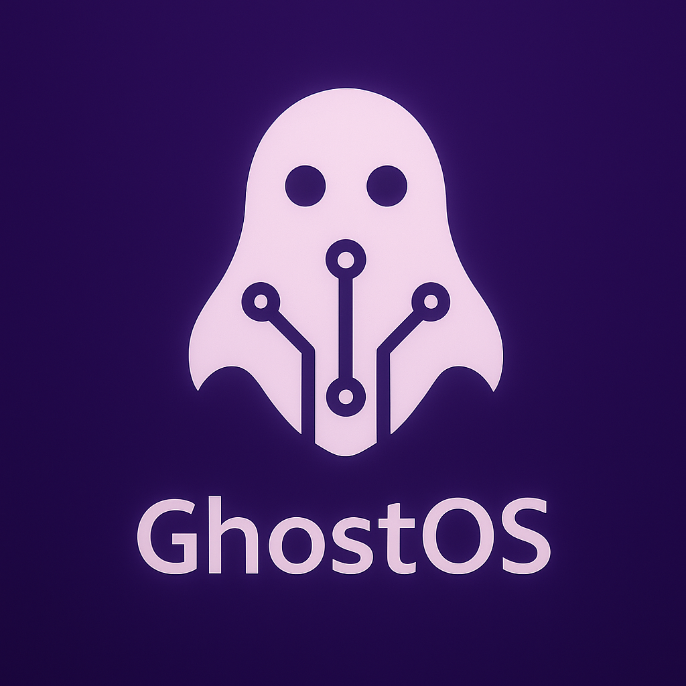

# AURA-BREE: Your Therapeutic Companion 🌟

<div align="center">
  
  <br>
  <strong>A privacy-first, local-storage therapeutic companion app with AI-powered features.</strong>
  <br><br>
  <em>© 2025 GodsIMiJ AI Solutions. All rights reserved.</em>
</div>

## ✨ Features

- **🤖 AI Chat**: Therapeutic conversations with AURA-BREE
- **🔮 Tarot Readings**: 3-card Past/Present/Future spreads
- **⭐ Daily Horoscopes**: Personalized astrological guidance
- **🌙 Dream Interpretation**: Symbolic dream analysis
- **💝 Mood Tracking**: Daily check-ins with streak tracking
- **🛡️ Safety Toolkit**: Crisis resources and emergency contacts
- **🎯 100% Local Storage**: No backend, no data collection

## 🚀 Quick Setup

1. **Install dependencies**:
   ```bash
   npm install
   ```

2. **Add your OpenAI API key**:
   ```bash
   # Create/edit .env file
   VITE_OPENAI_API_KEY=sk-your-actual-api-key-here
   ```

3. **Start development server**:
   ```bash
   npm run dev
   ```

4. **Build for production**:
   ```bash
   npm run build
   ```

## 🔐 Privacy & Storage

- **Local-First**: All data stored in browser localStorage
- **Device ID**: Unique identifier per device for data isolation
- **No Backend**: Zero server dependencies or data collection
- **Offline Capable**: Core features work without internet
- **GDPR Compliant**: No personal data leaves your device

## 🛠️ Tech Stack

- **Frontend**: React 18 + TypeScript + Vite
- **UI**: shadcn/ui + Tailwind CSS
- **AI**: OpenAI GPT-4o-mini (direct API calls)
- **Storage**: Browser localStorage with device ID persistence
- **Routing**: React Router
- **State**: React hooks + local storage

## 📱 PWA Features

- **Installable**: Add to home screen
- **Offline Ready**: Service worker for caching
- **Mobile Optimized**: Responsive design with bottom navigation
- **Touch Friendly**: Optimized for mobile interactions

## 🎯 No External Dependencies

- ❌ No Supabase or backend database
- ❌ No user authentication or accounts
- ❌ No data synchronization or cloud storage
- ❌ No analytics or tracking
- ✅ Pure frontend application
- ✅ Static hosting compatible

## 📚 Documentation

### **Complete Documentation Collection**
📁 **[Full Documentation Suite](./docs/)** - Comprehensive documentation collection

**Quick Links:**
- [**Project Summary**](./docs/PROJECT_SUMMARY.md) - Complete project overview and business plan
- [**Setup Guide**](./docs/SETUP_GUIDE.md) - Development environment setup
- [**User Guide**](./docs/USER_GUIDE.md) - How to use AURA-BREE features
- [**Technical Architecture**](./docs/TECHNICAL_ARCHITECTURE.md) - System design and technology stack
- [**Deployment Guide**](./docs/DEPLOYMENT_GUIDE.md) - Production deployment instructions

**Legacy Documentation:**
- [`LOCAL_STORAGE_SETUP.md`](./LOCAL_STORAGE_SETUP.md) - Complete local storage implementation details
- [`OPENAI_SETUP.md`](./OPENAI_SETUP.md) - OpenAI API integration guide

**External Resources:**
- [**Privacy Documentation**](https://aura-bree-privacy-docs.netlify.app/) - Comprehensive privacy policy and data handling practices

## 🚀 Deployment

Deploy to any static hosting service:
- **Netlify**: Drag & drop the `dist` folder
- **Vercel**: Connect your GitHub repo
- **GitHub Pages**: Enable in repository settings
- **Any CDN**: Upload the built files

## 🔧 Development

```bash
# Install dependencies
npm install

# Start dev server
npm run dev

# Build for production
npm run build

# Preview production build
npm run preview

# Lint code
npm run lint
```

## 🌟 Key Benefits

- **Zero Setup Complexity**: Just add OpenAI key and run
- **Maximum Privacy**: Data never leaves user's device
- **No Ongoing Costs**: No backend or database fees
- **Instant Loading**: Local storage = instant data access
- **Cross-Platform**: Works on any device with a browser
- **Future-Proof**: No vendor lock-in or service dependencies

---

## 📄 License & Copyright

**© 2025 GodsIMiJ AI Solutions. All rights reserved.**

This project is developed by GodsIMiJ AI Solutions with a focus on privacy-first mental health technology.

### 🏢 About GodsIMiJ AI Solutions
- **Mission**: Developing AI-powered solutions for mental wellness and personal growth
- **Focus**: Privacy-first, local-storage applications that put user data control first
- **Technology**: Cutting-edge AI integration with ethical design principles

### 🎨 Assets & Branding
- **Logo**: FlameOS favicon and branding elements
- **Additional Assets**: GhostOS and Eye of Kai collaborative branding
- **Design Philosophy**: Warm, accessible, and therapeutic visual identity

---

<div align="center">
  
  
  <br><br>
  <em>Made with ❤️ for mental wellness</em>
</div>

Read more here: [Setting up a custom domain](https://docs.lovable.dev/tips-tricks/custom-domain#step-by-step-guide)
